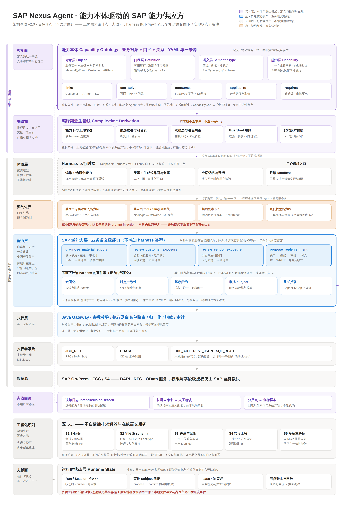

<div align="center">

<h3>A supplier of SAP capabilities, not yet another SAP Agent</h3>

<h4><i>Capability-ontology-driven · One call answers one business question · The harness is replaceable wholesale</i></h4>

> SAP business questions are sedimented into business-level capabilities: endpoint chains, `asOf` time consistency, cardinality reduction, and approval adjudication are all server-enforced; questions outside coverage are explicitly refused rather than answered with degraded guesses. The harness only selects and presents capabilities — switching hosts never produces a second set of business semantics.

**Capability Ontology Modeling · Compile-Time Derivation · Business-Level Capabilities · Server-Enforced Governance · Full-Chain Lineage · Replaceable Harness**

**Apache-2.0 · Self-Hosted · No Vendor Lock-In · SAP On-Prem**

<h4>A governed capability layer for SAP delivery scenarios</h4>

[](LICENSE)
[](services/gateway)
[](agent)
[](frontend)
[](#registered-capabilities-server-side-internals)
[](#target-achievement-status-s1s5)

<!-- TODO: DSH Chat screenshot or GIF -->

**English** · **[中文](README.md)**

</div>

**[Quick Start](#quick-start)** · **[Target Architecture](#target-architecture-agent-build-target)** · **[Current Architecture](#current-architecture-as-is)** · **[Key Features](#key-features)** · **[Target Achievement Status](#target-achievement-status-s1s5)** · **[Harness-Visible Surface](#harness-visible-surface-business-semantic-tools-contract-v2)** · **[Registered Capabilities](#registered-capabilities-server-side-internals)** · **[Tech Stack](#tech-stack)**

---

SAP Nexus Agent aims to be a **supplier of SAP capabilities**, not yet another SAP Agent. Four parties, one job each: the capability ontology (a single YAML source) defines business objects and business definitions; the compile-time derivation pipeline produces the Capability Manifest offline, with zero ontology queries at request time; the SAP domain capability layer exposes business-level capabilities — **one call answers one business question** — with endpoint chains, `asOf` consistency, and cardinality reduction fixed inside; the harness (dsh / MCP client / our own CLI) only does capability selection, presentation, and clarification, and is replaceable wholesale. The only security boundary is the remote Java Gateway: `bindingId`, RFC names, service URLs, HTTP methods, and credential references can never be supplied or overridden by the harness.

**Core principle: facts before narrative; capability is the boundary.**

> Of the four parties above, the capability ontology and the compile-time derivation pipeline are target state; for the current implementation see [“Target Achievement Status”](#target-achievement-status-s1s5).

---

## Quick Start

### Prerequisites

- Java 17 (no standalone Gradle install needed — the repo ships `services/gateway/gradlew`)
- Python 3.12+
- Node.js 20+
- SAP JCo 3 library files (for live SAP execution)
- SAP On-Prem connectivity and credentials (for live smoke tests)
- An OpenAI-compatible LLM endpoint and API key (for DSH Chat / harness-dsh; Rule mode and offline tests need neither)

**Without SAP connectivity or credentials** you can run the full offline test suite, call-plan evals, and registry validation in the [“Verification Baseline”](#verification-baseline-as-of-2026-09-26) below, but you **cannot run interactive queries** — even with `--intent-mode rule` (no LLM key needed) the Python Agent CLI still connects to the Gateway to execute; DSH Chat / harness-dsh additionally need an LLM key.

### Prepare the Python Environment

There is no `requirements.txt`; per `agent/pyproject.toml` the agent package is installed editable (the `test` extra provides `jsonschema`; `pytest` is also needed for the test commands below and is not declared in pyproject):

```bash
python3 -m venv .venv                          # Python 3.12+ required
.venv/bin/python -m pip install -e "agent[test]" pytest
```

### Environment Setup

```bash
cp .env.example .env
# Fill in SAP connection parameters; for DSH also set SAP_NEXUS_LLM_BASE_URL / SAP_NEXUS_LLM_API_KEY / SAP_NEXUS_LLM_MODEL
```

### Verification Baseline (as of 2026-09-26)

```bash
.venv/bin/python scripts/validate-registry-contract.py registry/capabilities.yaml
.venv/bin/python -m pytest agent/tests
PYTHONPATH=agent scripts/verify-agent-callplan-evidence.sh
npm --prefix frontend run verify
npm --prefix frontend run release-gate -- --profile all
```

Current baselines:

- Registry contract validation: `Registry contract valid` (deprecation warnings are all `extraction.matchers` → `binding.sources` migration notices; contract validity unaffected)
- Agent test suite: passes in full (with a small number of pre-existing skips / xfails)
- Frontend: `verify` (typecheck + vitest + next build) all green
- Call-plan Evals: all pass (the PENDING items in dry-run / derived-parameter have written cause analysis in the cases themselves — kept by design, not failures)
- Live equivalence (gated; `SAP_REST2RFC_LIVE=1`): after migration the three list capabilities are row-for-row, all-fields equivalent to the JCo baselines via SICF (direct SICF vs Gateway identical)
- Offline release gate: highest consecutive level `L3_ACTION_GOVERNED` reached 2026-08-19 (historical milestone; every hard gate shows no leakage/bypass and lineage is complete; `liveSmoke` makes no real SAP calls by design; report: `runtime/evals/results/agent-release-l3-2026-08-19T13-09-48-499Z.json`; forensics on the older 2026-08-10 report see [roadmap §1.1.4](docs/wiki/sap-nexus-agent-implementation-roadmap.md))

`PYTHONPATH=agent` verifies the current source tree directly.

### Launch Services

One-shot launch (the script runs in the foreground with logs under `runtime/dev-services/logs/`; Ctrl+C stops everything; `./start.sh stop` / `restart` are also available):

```bash
npm --prefix frontend install   # first time only: start.sh requires frontend/node_modules
./start.sh
```

Then open `http://127.0.0.1:3000/` — the root path redirects to `/chat` (DSH Chat); the legacy evidence Workbench remains at `/workbench`. The script sets no distro-specific `JAVA_HOME` default; when unset it uses the system Java (must be 17). Or start the services manually, step by step:

Terminal 1 — Gateway:

```bash
set -a; . ./.env; set +a
cd services/gateway
./gradlew --no-daemon bootRun
```

If your system default JDK is not 17, `export JAVA_HOME=<path to JDK 17>` first (do not hardcode a distro-specific path).

Terminal 2 — OData microservice (required for the purchase-order capability):

```bash
cd services/odata-service
PYTHONPATH=. python -m odata_service.server   # :8081
```

Terminal 3 — DSH Chat (recommended entry; requires an LLM key):

```bash
set -a; . ./.env; set +a
SAP_NEXUS_AGENT_ROOT=$(pwd) \
SAP_NEXUS_GATEWAY_URL=http://127.0.0.1:8080 \
npm --prefix frontend run dev
```

Open `http://127.0.0.1:3000/chat` (the root path redirects there; the classic Workbench remains at `/workbench`).

Optional — harness-dsh standalone CLI (separate terminal; the Next facade above must be running):

```bash
cd harness-dsh
npm ci && npm run build
cp .env.example .env      # OpenAI-compatible endpoint/key; SAP_NEXUS_FACADE_URL defaults to http://127.0.0.1:3000
npm start -- "Does A100 have enough stock at plant 1000, and how much is in transit?"
```

Optional — Python Agent CLI (no harness; Rule mode needs no LLM key, but a reachable Gateway and SAP connectivity are still required):

```bash
PYTHONPATH=agent .venv/bin/python -m sap_nexus_agent.cli \
  "How much available stock does A100 have at 1000?" \
  --gateway-url http://127.0.0.1:8080 --intent-mode rule
```

---

## Target Architecture (Agent Build Target)

> The diagram below is this project's **target architecture (the Agent build target)**, **not the current state of this repository**; the as-is implementation follows in the next section. The diagram shows target form only — no progress, counts, or dates — and is updated only when layers, layer responsibilities, contract red lines, or derivation relations change. Implementation progress is tracked solely in [“Target Achievement Status”](#target-achievement-status-s1s5) below and in [roadmap §1.1](docs/wiki/sap-nexus-agent-implementation-roadmap.md). The reading guide: **definitions at the top, reasoning at compile time, governance inside capabilities, replaceable experience**. The stance is “four parties, one job each”: the capability ontology (single YAML source), the compile-time derivation pipeline (offline Capability Manifest), the SAP domain capability layer (business level, core asset), and the harness (replaceable orchestration and presentation).



---

## Current Architecture (As-Is)

```text
Experience · Harness (replaceable)
  ┌──────────────────────────────┐  ┌──────────────────────────────────┐
  │ harness-dsh CLI (standalone   │  │ DSH Chat Workbench (/chat)       │
  │ Node package)                 │  │ browser + server-side in-process │
  │ dsh T-A-O loop · pinned rc.1  │  │ dsh runtime                      │
  └──────────────┬───────────────┘  └────────────────┬─────────────────┘
                 │ HTTP POST /api/semantic-tools      │ in-process call
                 └──────────────────┬─────────────────┘
                                    ▼
  ┌─────────────────────────────────────────────────────────────────────┐
  │ Next.js server (:3000)                                                │
  │ Semantic Tool Facade (contract v2 · shape validation · technical-key  │
  │   injection fail-closed)                                              │
  │ executeSemanticTool = single governed server entry (HTTP facade and    │
  │   dsh share it)                                                       │
  │ agent-runtime-adapter: spawns the Python Agent as a subprocess         │
  │ Composition Runtime: PlanExecutor · durable node ledger ·              │
  │   Projection · Recommendation · grounded Narrative · governed Action   │
  └────────────────────────────────┬────────────────────────────────────┘
                                   │ registered capabilityId only
                                   ▼
  ┌─────────────────────────────────────────────────────────────────────┐
  │ Java Gateway (:8080 · the only security boundary)                     │
  │ Parameter validation (ontology constraints) · executor routing        │
  │   (JCO_RFC / ODATA / REST_JSON) · result normalization               │
  │   → TechnicalExecutionResult · redaction / audit                      │
  └─────────┬──────────────────────────────┬────────────────────────┬────┘
            ▼                              ▼                        ▼
  ┌──────────────────────┐     ┌──────────────────────────┐  ┌──────────────────────┐
  │ SAP JCo (RFC/BAPI)    │     │ odata-service (:8081)     │  │ SICF rest2rfc        │
  └──────────┬───────────┘     │ Python read-only microsvc  │  │ pure-ABAP dynamic    │
             │                 │ · assembles $filter        │  │ reflection gateway   │
             │                 └────────────┬─────────────┘  │ (inside the SAP system)│
             └──────────────┬───────────────┘                └──────────┬───────────┘
                            ▼                                         ▼
                                  SAP On-Prem system

Side path: the Python Agent CLI (sap_nexus_agent.cli) can call the Gateway directly without a
harness (rule / llm intent); the classic Workbench at /workbench shares the same agent-runtime
+ composition governed chain as DSH Chat.
```

### Current Architectural Limits (Design Choices, Not Defects)

- Run/Session, principal ownership, approval, lease/idempotency, and cursor SSE are durable; but the current local JSONL/file store and placeholder principal are still not a shared multi-worker/HA store or a production identity system (mandatory before a second host — see the target architecture's supporting plane)
- The compile-time derivation pipeline (Capability Manifest), business-semantic `Definition` objects, field-level FactType schema, and relation graph remain target-state work; today's registry is still an endpoint-level capability registry
- Knowledge/RAG, free-form Tool Calling, a general Dynamic Planner, multi-WRITE/Saga, and automatic compensation remain Reserved / Not In Scope
- Graph databases and OWL reasoning runtime are reserved directions; JSON Schema + Registry Validator currently carry consistency duties

---

## Key Features

### Business-Level Tool Surface and Server-Enforced Governance (Core Differentiator)

- **Business-semantic tool surface (Semantic Tool contract v2)**: the harness sees only 4 business tools (see [“Harness-Visible Surface”](#harness-visible-surface-business-semantic-tools-contract-v2) below) — never a `capabilityId`, `rfcName`, `bindingId`, URL, or credential; technical-key injection is rejected fail-closed at the facade
- **One server-enforced governance chain**: the HTTP facade and the in-process dsh handlers share `executeSemanticTool`; intent selection, CallPlan, validation, and approval all stay server-side. The harness process has no surface that reaches the Gateway / RFC / bindings / credentials directly (locked by `harness-dsh/tests/architecture.test.ts`)

### Replaceable Harness (DSH Pilot)

- **Two harness forms**: the standalone `harness-dsh/` Node CLI (a dsh T-A-O loop calling the semantic-tool facade over HTTP) and the in-app **DSH Chat** (`/chat`, a server-side in-process dsh runtime with streamed reasoning traces, tool cards, and approval interaction); the root path `/` now 307-redirects to `/chat`
- **Version pin**: `@deepseek-ai/dsh-*` packages are pinned exactly to `0.1.5-rc.1` and `@deepseek-ai/cordis` to `4.0.2`; while dsh is in preview, every upgrade is a separate reviewed change

### Current Semantic Layer: The Endpoint-Level Capability Registry

The fields and mechanisms below are all parts of the **implemented endpoint-level capability registry**; the capability ontology (business objects / business `Definition`s / the relation graph) has not landed yet — see [“Target Achievement Status”](#target-achievement-status-s1s5).

- **Capability Ontology** — Every SAP operation (read/write) is modeled as a formal capability with `ontologyIri`, `semanticType`, typed inputs/outputs, and fact type references
- **Semantic Parameter Mapping** — Input parameters link to ontology concepts (`MaterialNumber`, `Plant`) via `semanticName`/`semanticType`, decoupled from SAP technical parameters (`MATERIAL`, `PLANT`)
- **Executor Binding** — Each capability binds to a specific executor (`JCO_RFC` / `ODATA`) via an allowlisted `bindingId`; runtime replacement is rejected
- **Ontology Constraint Runtime** — `constraint_runtime.py`, built on **rdflib + pyshacl`: build-time codegen produces SHACL shapes from the registry and binds them to the snapshot; at request time it validates parameter shapes and evaluates preconditions via SPARQL (query plans are prepared once and cached). It strictly **separates resolve from enforce** — it only answers "does the shape hold"; blocking and execution stay with deterministic code. Heavier graph platforms (Semantica) were evaluated in `spikes/semantica-shadow` and are not introduced at this stage
- **OWL Reserved** — `ontologyIri` and `semanticType` preserve a migration path toward heavier ontology reasoning; current consistency gates are carried by JSON Schema + Registry Validator + the SHACL runtime above
- **Declarative Intent Parsing** — Rule-mode intent parsing is fully declaration-driven (`registry/capabilities.yaml` `intent` blocks + `registry/semantic-types.yaml` type catalog); adding a new capability requires no Agent code changes

### Governance & Security

- **Fail-closed** — Unsupported executor types (`CDS_ADT` / `SQL_READ`) default to denial; every executor fails closed when credentials are missing or invalid
- **Parameter injection protection** — Callers cannot supply or override `rfcName`, `bindingId`, service URLs, HTTP methods, credential references, raw SQL, or CDS objects; the semantic-tool facade scans for technical keys at any depth
- **READ safety** — READ capabilities must never call `BAPI_TRANSACTION_COMMIT` or `BAPI_TRANSACTION_ROLLBACK`
- **WRITE human approval** — WRITE capabilities (purchase requisition creation / the `propose_replenishment` proposal) execute only when a recorded exact-subject human confirmation exists; the approval subject is computed and verified server-side
- **Full-chain audit** — Every execution produces a TraceSpan / JSONL trace recording intent → CallPlan → validation → execution → evidence → narrative

### Executor Families

| Type        | Status        | Description                                                                      |
| ----------- | ------------- | -------------------------------------------------------------------------------- |
| `JCO_RFC`   | ✅ Live        | Direct RFC/BAPI execution via SAP JCo                                            |
| `ODATA`     | ✅ Live        | Gateway thin reverse proxy → Python odata-service (:8081) → SAP OData            |
| `REST_JSON` | ✅ Live        | Basic-Auth POST to the in-SAP pure-ABAP rest2rfc SICF gateway; registry-mapping-driven |
| `CDS_ADT`   | 🔒 Fail-closed | Architecture reserve                                                             |
| `SQL_READ`  | 🔒 Fail-closed | Architecture reserve                                                             |

---

## Target Achievement Status (S1–S5)

The current implementation assessed against the target architecture's S1–S5 build sequence (re-verified 2026-09-26); full status tables are in [roadmap §1.1](docs/wiki/sap-nexus-agent-implementation-roadmap.md), and concrete test/gate figures are recorded only in the [“Verification Baseline”](#verification-baseline-as-of-2026-09-26) above.

- **Sequence progress**: S1 evidence complete · S2 (object keys + field-level schema) not started · S3 (definitions + relations into the ontology + compile-time pipeline) not started · **S4 capability-granularity lift complete, but it jumped over S2/S3** · S5 multi-host validation partially done (the cross-host consistency gate passes; MCP exposure and a third-party harness are not done).
- **Layer status**: the harness experience layer, the contract boundary (four red lines), the SAP domain capability layer (4 business-semantic tools, 3 READ + 1 WRITE), and the Java Gateway with executors (JCO_RFC/ODATA/REST_JSON all live) are **built**; the compile-time derivation pipeline and runtime-state layer are **partial** (a hand-written versioned JSON Schema contract `contractVersion=2` exists; local JSONL store + placeholder principal); **the capability ontology (objects/definitions/relations) and the offline decision-feedback loop are untouched — the ontology is the one layer not yet on duty**.
- **Three structural requirements**: ① granularity "**achieved, but misplaced**" (the 4 business tools exist but are declared in server code, not in the ontology; endpoint-level tools are no longer external); ② semantic assets **not achieved** (field-level schema, business definitions, and relations are all empty; tool descriptions remain hand-written); ③ identity & approval **partial** (approval handles and server-side identity injection exist; caller principal is still a placeholder and storage is local).
- **Next steps are backfill, not new construction**: ① put a CI gate requiring every new capability output field to reference a `Definition` id (placeholder ids acceptable initially); ② split `ontology-core` (open-source) from `ontology-tenant` (kept private) as early as possible — cheapest while the ontology is nearly empty; ③ lift the definitions of the 4 existing capabilities (available stock / overdue / exposure) out of code one by one, producing field-level schema and the first cross-domain link.
- **The one real break point**: business semantics are fixed in server-side code; the self-check "change one ontology line and Agent behavior changes with zero code changes" does not yet pass.
- **The offline end-to-end governed composition main chain works**: intent → CallPlan → validation/execution → ExecutionResult → ReasoningFact → narrative → durable Workbench replay → plan-aware single Action continuation; the TypeScript composition coordinator wires up PlanExecutor, OutputProjection, Recommendation, and grounded Narrative (the single-capability `CallPlan` main chain remains available).
- **Python Agent responsibilities**: LLM-first intent, closed-set recall, five-state decisioning, and PlanGraph v2 authoring; runs either as a subprocess spawned on demand by the Next server or standalone via the CLI.
- **Release gate milestone**: the offline L1/L2/L3 gate reached its highest consecutive level `L3_ACTION_GOVERNED` on 2026-08-19; scale, the four hard-gate figures, and reproduction commands are in the [“Verification Baseline”](#verification-baseline-as-of-2026-09-26), and forensics on the older 2026-08-10 report are in [roadmap §1.1.4](docs/wiki/sap-nexus-agent-implementation-roadmap.md).
- **SAP connectivity**: all seven capabilities have real-SAP execution paths — the MM domain via JCo/OData; **the three SD/FI list capabilities migrated to REST_JSON** (2026-09-25) through the in-SAP pure-ABAP rest2rfc SICF gateway, with post-migration row-for-row, all-fields live equivalence (AP/AR/SD all verified). JCo/ODATA/REST_JSON share one set of SAP host, client, user, and password (`SAP_ASHOST` + `SAP_HTTP_PORT` / `SAP_SYSNR`); connection values and credentials exist only in Gateway-controlled configuration. Any live WRITE still requires exact-subject Human Approval.

---

## Harness-Visible Surface: Business Semantic Tools (Contract v2)

The harness may name only business tools and slots; internally the server selects a capability chain from the registered capabilities — the harness never builds the call graph.

| Semantic tool | Required slots | Kind | Server-side capability chain (registry-selected) |
| --- | --- | --- | --- |
| `diagnose_material_supply` | — | READ | stock availability + open purchase orders (`MM.Inventory.GetAvailability` · `MM.PurchaseOrder.GetList`) |
| `review_customer_exposure` | `customerNumber` (company code additionally needed for AR items) | READ | sales-order net values + open AR items (`SD.SalesOrder.GetList` · `FI.AR.GetOpenItems`) |
| `review_vendor_exposure` | `vendor` · `companyCode` | READ | open AP items (`FI.AP.GetOpenItems`) |
| `propose_replenishment` | `material` · `plant` · `requiredQuantity` · `targetDate` · `purchasingGroup` | WRITE draft | gap diagnosis → purchase requisition proposal; exact-subject human approval before execution (`MM.PR.CreateDraft`) |

> Note: the table reflects the capability chains the server actually selects today. In the target architecture, `review_vendor_exposure`'s internal chain additionally includes a purchase-order endpoint; that is not yet internalized. The harness-visible surface has dropped from 7 endpoint-level tools to these 4 business-semantic tools (visibility governance caps the surface at 15).

---

## Registered Capabilities (Server-Side Internals)

| Capability ID                  | Name                                                | Executor  | SAP Endpoint                    | Status                                        |
| ------------------------------ | --------------------------------------------------- | --------- | ------------------------------- | --------------------------------------------- |
| `MM.Inventory.GetAvailability` | Stock/Requirements List (MD04)                      | `JCO_RFC` | `BAPI_MATERIAL_STOCK_REQ_LIST`  | ✅ active                                      |
| `MM.PurchaseOrder.GetList`     | Purchase Order List                                 | `ODATA`   | `API_PURCHASEORDER_PROCESS_SRV` | ✅ active                                      |
| `MM.Material.GetInfo`           | Material Info (base UoM / purchasing group)        | `JCO_RFC` | `BAPI_MATERIAL_GET_DETAIL`      | ✅ active                                      |
| `MM.PR.CreateDraft`             | PR Create Draft                                     | `JCO_RFC` | `BAPI_PR_CREATE`                | ✅ active (requires approval)                 |
| `SD.SalesOrder.GetList`        | Sales Order List (VA05-style)                       | `REST_JSON` | `BAPI_SALESORDER_GETLIST`     | ✅ active (live equivalence proven)  |
| `FI.AR.GetOpenItems`           | Customer Open Receivables                           | `REST_JSON` | `BAPI_AR_ACC_GETOPENITEMS`    | ✅ active (live equivalence proven)  |
| `FI.AP.GetOpenItems`           | Vendor Open Payables                                | `REST_JSON` | `BAPI_AP_ACC_GETOPENITEMS`    | ✅ active (live equivalence proven)  |

7 capabilities: 6 read-only (`kind: Function`, `sideEffect: none`) plus one write
(`MM.PR.CreateDraft`), which cannot execute without a recorded human confirmation.

---

## Repository Layout

```text
agent/                   Python Agent package: intent, CallPlan/PlanGraph v2, tests, evals
frontend/                Next.js: DSH Chat (/chat), classic Workbench (/workbench),
                         semantic-tool facade, server-side dsh runtime, composition runtime
harness-dsh/             Replaceable-harness pilot: standalone Node CLI (dsh T-A-O, pinned 0.1.5-rc.1)
services/
  gateway/               Java Spring Boot SAP Gateway (modules core/jco/odata/rest/app, the only security boundary)
  odata-service/         Python OData read-only microservice (:8081)
tests/live/              Gated live equivalence verification (skipped by default; SAP_REST2RFC_LIVE=1)
registry/                Capability registry and executor binding catalog (single YAML source)
schemas/                 JSON Schema contracts
ontology/                Offline OWL identity skeleton (reserved)
openspec/                Classic-workflow specs and change archive
runtime/                 Runtime traces, dev-services, gateway-jco, release-gate results
evals/                   Agent eval cases
scripts/                 Verification and registry validation helpers
docs/
  wiki/                  Architecture, roadmap, technology selection (source of truth)
  comet/                 Native-workflow change archive
  runbooks/              22 historical runbooks (archived; supplementary lookup only, not a fact source)
```

---

## Tech Stack

| Layer                          | Technology                                                                                                                                                    |
| ------------------------------ | ------------------------------------------------------------------------------------------------------------------------------------------------------------- |
| Harness                        | DSH Chat (in-Next dsh runtime, SSE streaming) + standalone harness-dsh CLI; `@deepseek-ai/dsh-*` pinned `0.1.5-rc.1`, cordis `4.0.2`; harness replaceable     |
| Agent                          | Python package + OpenAI-compatible LLM (DeepSeek `deepseek-chat` by default) + Rule hybrid                                                                    |
| Server orchestration           | React/Next.js server side: Semantic Tool Facade, Composition Runtime, durable JSONL stores                                                                    |
| Gateway                        | Java 17 / Spring Boot / Gradle multi-module (the only security boundary)                                                                                      |
| SAP Connectivity               | SAP JCo 3 (RFC) + SAP OData (HTTP via odata-service) + SICF rest2rfc (HTTP/JSON, REST_JSON); credentials shared across the three paths                       |
| Frontend                       | React / Next.js / TypeScript                                                                                                                                  |
| Capability Registry            | YAML + JSON Schema                                                                                                                                            |
| Ontology                       | YAML + JSON Schema + immutable in-memory graph; offline OWL skeleton; graph database and compile-time derivation pipeline are target-state                    |
| Runtime State                  | Local JSONL/file-backed Run/Session/Approval + JSONL traces; not a shared multi-worker/HA store; shared/production durable runtime requires a separate change |
| Authentication & Authorization | Placeholder principal, not productized; shared environments require server-owned principal / tenant / role / data scope / ApprovalActor                      |

---

## Documentation

- [Technical Architecture](docs/wiki/sap-nexus-agent-technical-architecture.md)
- [Implementation Roadmap](docs/wiki/sap-nexus-agent-implementation-roadmap.md)
- [Technology Selection](docs/wiki/sap-nexus-agent-technology-selection.md)
- [OpenHarness Semantic Orchestration Analysis](docs/wiki/sap-nexus-agent-openharness-semantic-orchestration.md)
- [harness-dsh README](harness-dsh/README.md)

---

## License

This project is licensed under [Apache-2.0](LICENSE).

---

## Quick Links

|                          |                                                              |
| ------------------------ | ------------------------------------------------------------ |
| AGENTS.md / CLAUDE.md    | Project-level agent behavioral rules                         |
| registry/                | Capability registry (7 registered capabilities)              |
| harness-dsh/             | The replaceable harness (DSH CLI)                            |
| frontend/src/server/dsh/ | Server-side dsh runtime and semantic-tool wiring             |
| ontology/                | OWL ontology skeleton                                        |
| evals/                   | Evaluation test cases                                        |
